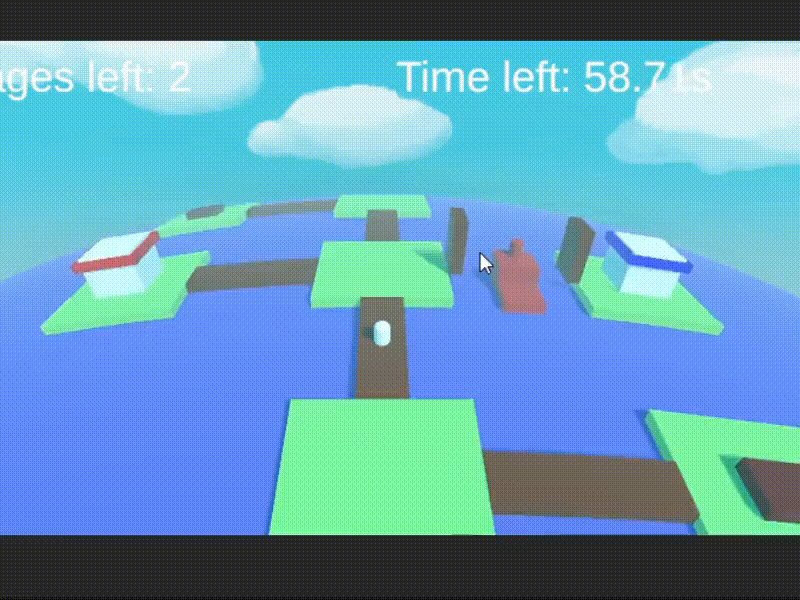

# Summary
- [Shaders](#shaders)
  - [Fur shader](#fur-shader)
  - [World bending in Unity](#world-bending-in-unity)
  - [World bending in OpenGL](#world-bending-in-opengl)
  - [Scanner effect](#scanner-effect)
  - [Holographic](#holographic)
- [Visual Effects](#visual-effects)
  - [Lock and chains](#lock-and-chains)

# Shaders
## Fur shader

## World bending in Unity

## World bending in OpenGL

## Scanner effect

## Holographic 

# Visual effects

## Lock and chains

